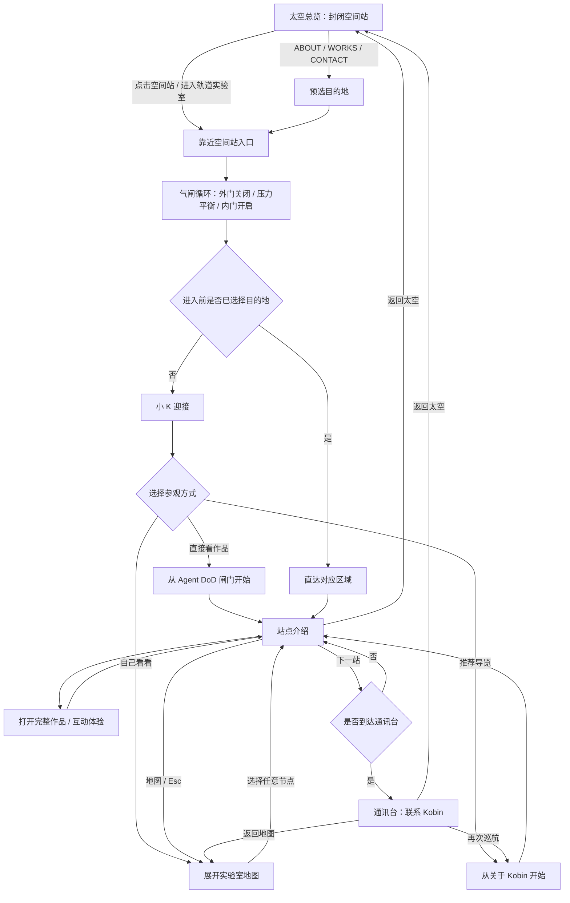

# KobinFlow 轨道实验室主干流程

## 交互流程



## 状态与实现映射

| 阶段 | 状态 | 核心反馈 | 完成情况 |
|---|---|---|---|
| 太空总览 | `exterior` | 轨道日出、空间站锁定、入口 CTA、ABOUT/WORKS/CONTACT | 已完成 |
| 靠近入口 | `approach` | 摄影机接近空间站、航向与距离 HUD | 已完成 |
| 气闸 | `airlock` | 真实气闸 GLB、门体动画、压力循环进度 | 已完成 |
| 小 K 迎接 | `welcome` | 真实机器人 GLB、三种参观方式 | 已完成 |
| 自主导航 | `map` | 六节点实验室地图、当前位置与已访问状态 | 已完成 |
| 站点介绍 | `station` | 项目说明、验收证据、完整实验入口、下一站 | 已完成 |
| 通讯台 | `comms` | 联系 Kobin、返回地图、重新巡航 | 已完成 |

状态机位于 `src/lib/experience-flow.ts`，视觉场景位于
`src/components/experience/interior/`，HTML 交互层与 3D 场景共享同一状态源。

## 分支规则

- 从主 CTA 或直接点击空间站进入：没有预选目的地，气闸完成后由小 K 迎接。
- 从 `ABOUT`、`WORKS`、`CONTACT` 进入：保留目的地，通过气闸后直达对应区域。
- “推荐导览”从关于 Kobin 开始；“直接看作品”从 Agent DoD 闸门开始；“自己看看”打开地图。
- 站点顺序为：关于 → DoD 闸门 → 材质球墙 → 产品转台 → 机械臂 → 通讯台 → 关于。
- 站点内按 `Esc` 返回地图；任意舱内页面均可返回太空总览。

## 8.5 分验收门槛

每个核心阶段必须同时满足以下条件，任一项低于 8.5 即不算完成：

| 维度 | 8.5/10 门槛 | 自动化 / 人工证据 |
|---|---|---|
| 视觉层级 | 3 秒内能识别主角、当前阶段和下一步 | 桌面与 390×844 关键帧检查 |
| 交互可理解性 | 主操作有明确 hover/focus/pressed 反馈，结果不歧义 | Playwright 主流程与三种导览分支 |
| 连续性 | `approach → airlock → welcome/直达` 顺序不可跳变 | DOM 状态历史断言 + reducer 单测 |
| 响应式 | 不横向溢出，关键控制可见且触控目标不小于 44px | 移动端边界测试 |
| 可访问性 | 语义按钮/链接、键盘返回、reduced-motion 完整可用 | 键盘与动效偏好测试 |
| 性能与稳定性 | 资产单个小于 3MB；外景自适应画质；加载中不白屏 | 资产预算单测、rAF 遥测、生产构建 |
| 失败降级 | 无 WebGL 时仍可浏览作品和联系入口 | WebGL 初始化失败测试 |

## 验证命令

```bash
npm test
npm run lint
npm run build:e2e
npm run test:e2e
```

`build:e2e` 使用独立的 `.next-e2e` 输出目录，因此可与本地 `next dev` 同时运行，避免两个进程互相改写 `.next`。

## 2026-09-14 本轮验收记录

以下分数是按本文件的统一 10 分制进行的产品内审，不代表第三方奖项评分。视觉分来自 1200×1000 桌面关键帧及 390×844 移动端关键帧复核；交互分同时参考自动化结果。

| 核心阶段 | 视觉 | 交互 | 验收结论 |
|---|---:|---:|---|
| 太空总览 | 9.1 | 8.8 | 电影感地球弧面、轨道日出与空间站入口构图明确 |
| 靠近入口 | 8.8 | 8.7 | 摄影机推进与航向 HUD 连续，状态顺序有自动化记录 |
| 气闸循环 | 8.9 | 8.7 | 真实气闸模型、门体与冷暖光过渡构成独立场景 |
| 小 K 迎接 | 8.8 | 9.0 | 角色、全息终端与三种参观方式一屏可理解 |
| 实验室地图 | 8.7 | 9.0 | 六节点、当前位置与访问痕迹清楚，桌面/移动均无溢出 |
| 作品站点 | 8.7 | 8.9 | 项目内容、验收证据、完整实验与下一站层级明确 |
| 通讯台 | 8.8 | 8.9 | 琥珀通信信号形成旅程收束，可返回地图或外景 |
| 移动端重排 | 8.6 | 8.8 | 390×844 双列地图与可滚动内容面板，关键按钮仍可触达 |
| 无 WebGL 降级 | 8.5 | 8.8 | 不依赖 3D 也能继续浏览四个作品，无白屏与死路 |

结果：所有核心阶段的视觉和交互评分均不低于 **8.5/10**。本轮验证为 **72 个单元断言通过、18 个浏览器场景通过、Lint 通过、Next.js 生产构建通过**。
